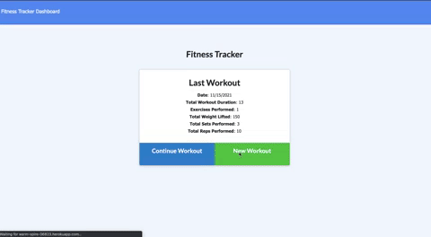

# workout-tracker
Workout tracker is a daily workout tracker. As a user I am able to log multiple exercises in a workout on a given day. I am able to rack the name, type, weight, sets, reps, and duration of exercise. If the exercise is a cardio exercise, I am able to track my distance traveled

## Getting Started
1. Install express
2. Install if-env
3. Install Mongoose
4. Install Morgan

## Usage 
1. run the mongo database by command line "mongo"
2. run the seeds by command "npm run seed"
3. generate database with "npm start"
4. (note: if link hasn't been visited in a while it may take a minute for Heroku to launch the website)

## Mock Up

## Built With

* [JavaScript]
* [Nodejs]
* [HTML] 
* [CSS]
* [MongoDB]
* [Mongoose]
* [Morgan]

## Deployed Link

* [See Github Site](#) https://github.com/umeramalek/workout-tracker
* [See Live Site](#) https://warm-spire-06823.herokuapp.com/?id=61933a893e0e220029406633

## Authors

* **UMERA MALEK** 

- [Link to Portfolio Site](https://umeramalek.github.io/umeramalek-portfolio-3/)
- [Link to Github](https://github.com/umeramalek)
- [Link to LinkedIn](www.linkedin.com/in/umeramalek)

